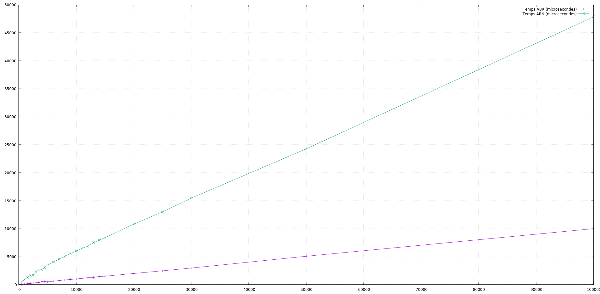
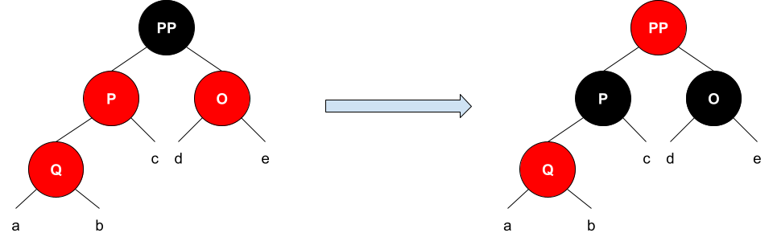
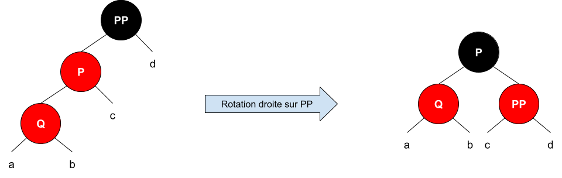
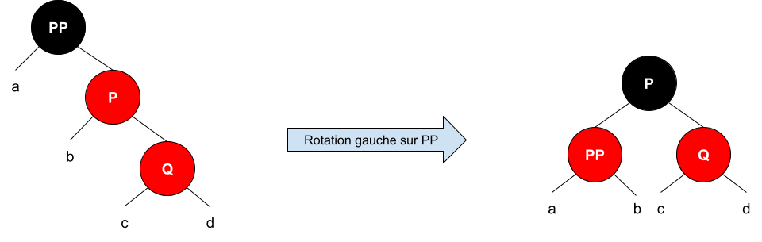
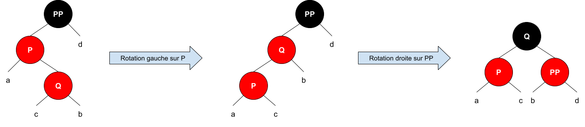
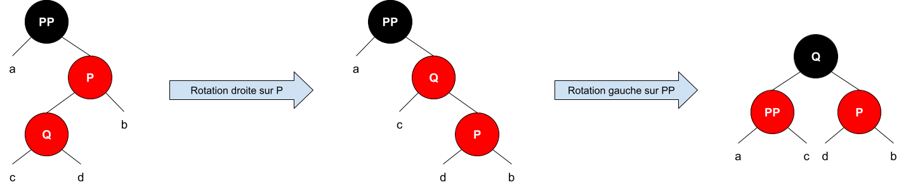

# <div style="text-align:center">TP noté LIFAP6 (7 & 8) </div>
## <div style="text-align:center">Arbre de Recherche Bicolore</div>

BERNOT Camille (p1908800)
FIETIER Loris (p1805561)

### Travail à réaliser

Projet effectué en binôme dans le cadre de l'UE LIFAP6.
On se propose de réaliser un module Collection d’`Elements` implantée sous forme d’`Arbre Rouge et Noir`. Vous veillerez à ce que ce module Collection soit bien modulaire, c’est à dire que votre module Collection devra être indépendant de la nature des Elements stockés. Vous vous limiterez aux opérations d’**initialisation** (constructeur) et de **testament** (destructeur) d’une collection, ainsi qu’aux opérations d’**insertion** et de **recherche d’un élément**, sans aborder la question de sa suppression. Vous offrirez également une **procédure de visualisation de l’état interne de l’arbre** modélisant une collection. Cette procédure pourra appeler la procédure interne d’affichage d’un sous-arbre.

### Performances

Nous avons calculer le temps d'insertion de n éléments aléatoires dans un ABR et un ARN et établir le graphique suivant :



Nous avons pu obtenir ce graphique grâce à la commande gnuplot :
    
    plot "./data/perfs_insertion.txt" using 1:2 title "Temps ABR (microsecondes)" with linespoints, "./data/perfs_insertion.txt" using 1:3 title "Temps ARN (microsecondes)" with linespoints


On remarque que l'insertion dans un ARN est beaucoup plus chronophage que l'insertion dans un ABR. Cela est probablement dû aux opérations de rééquilibrages effectuées dans les arbres rouge et noir. 

### Précisions sur l'insertion dans un ARN

Chaque élément est d'abord inséré aux feuilles comme pour un ABR et se voir attribué la couleur rouge. La fonction `void equilibrage(Noeud* node)` est ensuite appellée afin de réequilibrer l'arbre si les regles suivantes ne sont pas respectées : 
- La racine d'un arbre est toujours noire.
- Un noeud rouge ne peut pas avoir de fils rouge.
- Si le noeud inséré possède un oncle rouge, alors le père et l'oncle prennent la couleur noire et le grand-père prend la couleur rouge.



- Si le noeud inséré ne possède pas d'oncle rouge, alors on fait une **rotation droite** ou une **rotation gauche** en fonction de la position du noeud inséré par rapport à son père et son grand-père.

</br>
     
Voici les différents cas possibles de positions du noeud à insérer et les opérations de rotation correspondantes :

**Le noeud inséré est le fils gauche du père, lui-même fils gauche du grand-père**


**Le noeud inséré est le fils droit du père, lui-même fils droit du grand-père**


**Le noeud inséré est le fils gauche du père, lui-même fils droit du grand-père**


**Le noeud inséré est le fils droit du père, lui-même fils gauche du grand-père**



### Exemple détaillé

Prenons donc l'exemple de l'insertion successive de 10, 40, 60, 20 dans un ARN.
> Dans cette documentation, les noeuds ne sont pas colorés en fonction de leur couleur.

#### Insertion de 10

Ici, l'arbre étant vide, on rentre dans la condition suivante :
``` c++
if(pere == nullptr){
    node->couleur = 'N';
}
```
Le noeud est donc coloré en noir car il est racine de l'arbre.

On obtient donc :

    ──────┤10 (N)

#### Insertion de 40

Ici, on rentre dans la condition suivante :
``` c++
else if(pere->couleur == 'N'){
    //cout << "***** Cas equilibré de l'ARN ******" << endl;
    return;
}
```

Le noeud garde sa couleur par défaut (rouge) car son père est noir. L'arbre est déjà équilibré.

On obtient donc :

          +──────┤40 (R)
    ──────┤10 (N)

#### Insertion de 60

Le noeud ayant un père rouge et ne possédant pas d'oncle rouge, on entre dans aucun cas de la procédure `equilibrage(Noeud* node)`. On entre alors dans la procedure `cas2(Noeud*)` qui effectue une rotation gauche sur le noeud `10`. 

On obtient alors :

                 +──────┤60 (R)                       +──────┤60 (R)
          +──────┤40 (R)             ==>        ──────┤40 (N)
    ──────┤10 (N)                                     +──────┤10 (R)


#### Insertion de 20

Le noeud possède un père rouge et un oncle rouge. On peut donc entrer dans le cas de l'oncle rouge. On fait donc un premier appel sur `equilibrage(20)` où l'on rentre dans le cas de l'oncle rouge. Le pere et l'oncle sont donc colorés en noir et le grand-père en rouge. 

``` c++
void ARN::casOncleRouge(Noeud* node){
    Noeud* pere = getNoeudParent(node);
    Noeud* gdPere = getNoeudGrandParent(node);
    Noeud* oncle = getNoeudOncle(node);
    pere->couleur = 'N';
    oncle->couleur = 'N';
    gdPere->couleur = 'R';
    equilibrage(gdPere);
}
```

On appelle ensuite le `equilibrage(grand-pere)` et l'on rentre dans le cas de la racine 

``` c++
if(pere == nullptr){
    node->couleur = 'N';
}
```

On obtient alors :

          +──────┤60 (R)                              +──────┤60 (N)
    ──────┤40 (N)                   ==>         ──────┤40 (N)
                 +──────┤20 (R)                              +──────┤20 (R)
          +──────┤10 (R)                              +──────┤10 (N)    