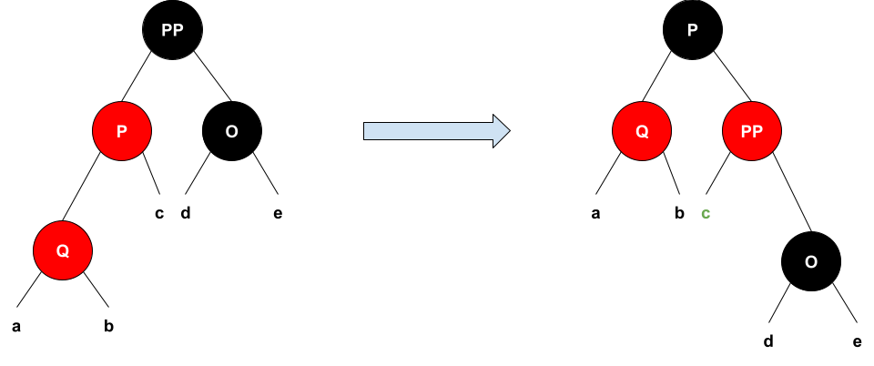

# 
TP noté LIFAP6 (7 & 8) 

## 
Arbre de Recherche Bicolore

### Travail à réaliser

Projet effectué en binôme dans le cadre de l'UE LIFAP6.
On se propose de réaliser un module Collection d’`Elements` implantée sous forme d’`Arbre Rouge et Noir`. Vous veillerez à ce que ce module Collection soit bien modulaire, c’est à dire que votre module Collection devra être indépendant de la nature des Elements stockés. Vous vous limiterez aux opérations d’**initialisation** (constructeur) et de **testament** (destructeur) d’une collection, ainsi qu’aux opérations d’**insertion** et de **recherche d’un élément**, sans aborder la question de sa suppression. Vous offrirez également une **procédure de visualisation de l’état interne de l’arbre** modélisant une collection. Cette procédure pourra appeler la procédure interne d’affichage d’un sous-arbre.

### Avancée du projet :

Module `Noeud`
- Constructeur par défaut et avec paramètre
- Destructeur
  
Module `ARN` (Arbre Rouge et Noir)
- [X] Constructeur par défaut 
- [X] Destructeur
- [X] Insertion d'un élément
- [X] Rééquilibrage
  - [X] Rotation droite
  - [X] Rotation gauche
  - [X] Cas de l'oncle rouge
- [X] Affichage 

Module `ABR` (Arbre Binaire de Recherche non équilibré)
- [X] Constructeur par défaut
- [X] Destructeur
- [X] Insertion d'un élément
- [X] Affichage

### L'insertion dans un Arbre bicolore

#### Etape 1 : insertion du Noeud
Lors de l'insertion dans un `ARN`, la feuille nouvellement créée est rouge.
Les propriétés de l'arbre ne sont donc plus forcément respectées. 
On réalise alors plusieurs étapes afin de rééquilibrer l'arbre.

#### Etape 2 : réequilibrage si oncle rouge
Si le `Noeud` Q possède un oncle rouge O, alors : 
- P et Q deviennent noirs 
- PP devient rouge
- Faire ces étapes récursivement de bas en haut jusqu'à atteindre la racine ou un oncle ou un arrière grand-père noir

> **La racine doit rester noire.
**

#### Etape 3 : si pas d'oncle rouge

##### 1)  Si le `Noeud` **Q** fils gauche de **P**, lui-même fils gauche de **PP**
On fait alors une **rotation droite** :  
- rotation des éléments vers la droite 
- échange des couleurs de P et de PP

> L'insertion est terminée après cette opération.

#### 2) Si le `Noeud` **Q** est le fils droit de **P**, lui-même fils gauche de **PP**
On fait alors une **rotation gauche**. Cela équivaut à une double rotation droite. 

    

#### 3) Si le `Noeud` **Q** est fils droit de **P**, lui-même fils droit de **PP**
Symétrie du cas 1)  

#### 4) Si le `Noeud` **Q** est le fils gauche de **P**, lui-même fils droit de **PP**
Symétrie du cas 2)
